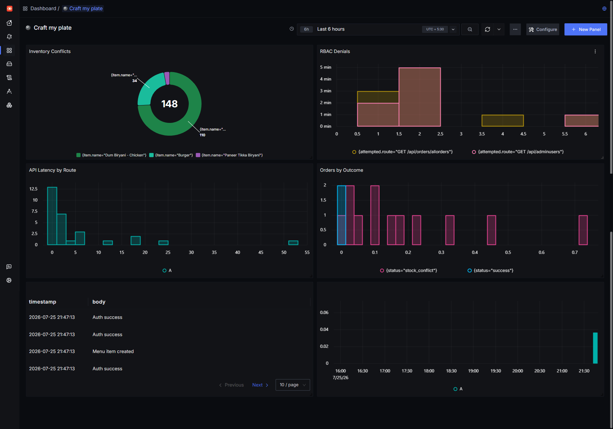

# Craft My Plate 🍲

## Making Craft My Plate the Ultimate Food Solution for Every Celebration! 🎉

### Project Overview
CraftMyPlate is a comprehensive food ordering platform that enables users to order food for various celebrations and events with role-based access control (RBAC).

## 🚀 Live Demo
- Website: [Craft My Plate](https://craft-my-plate-lovat.vercel.app/)
- GitHub Repository: [GitHub](https://github.com/sushmakoteswari/craft-my-plate)

## 🛠 Tech Stack
### Frontend:
- Next.js (React Framework)
- Tailwind CSS for styling
- Axios for API calls
- Shadcn UI components

### Backend:
- Node.js
- Express.js
- MongoDB (Database)
- Railway App (Backend Deployment)

## 🔐 Role-Based Access Control
The application implements three levels of access:
- **User:** Regular customers who can browse and order food.
- **Manager:** Additional privileges for order and menu management.
- **Admin:** Full system access and control over users, orders, and menu items.

## 🔑 Authentication (Backend Routes)
### Endpoints:
- **Login:** `/auth/login`
- **Register:** `/auth/register`

### Admin:
#### Manage Users:
- Fetch Users: `POST /adminusers`
- Update User: `PUT /adminusers/:id`
- Delete User: `DELETE /adminusers/:id`

#### Manage Menu:
- Add menu items: `POST /menu`
- Update menu items: `PUT /menu/:id`
- Remove menu items: `DELETE /menu/:id`
- View menu items: `GET /menu` (accessible to all users)

#### Orders:
- Place new order: `POST /order`
- View personal order history: `GET /order`
- View all orders (Admin & Manager only): `GET /order/allorders`
- Update order status (Admin & Manager only): `PUT /order/:id/status`

## 🌟 Key Features
- JWT-based secure authentication & authorization
- Role-based access control
- Responsive design with Tailwind CSS
- Modern UI with Shadcn components
- RESTful API architecture
- MongoDB integration

## 🚀 Deployment
### Frontend:
- Deployed on **Vercel** for optimal performance and reliability

### Backend:
- Hosted on **Railway App** for scalable server infrastructure

## ⚙️ Getting Started (Project Setup)
```sh
# Clone the repository
git clone https://github.com/sushmakoteswari/craft-my-plate.git

# Install dependencies (Frontend)
cd frontend
npm install
npm run build
npm run dev

# Install dependencies (Backend)
cd ../backend
npm install
npm run dev
```

## 🌍 Environment Variables
### Backend:
```sh
MONGODB_URI=your_mongodb_connection_string
JWT_SECRET=your_jwt_secret
PORT=5000
```

### Frontend:
```sh
NEXT_PUBLIC_API_BASE_URL=backend_api_url
```

## 📊 Observability — Built for Agents of SigNoz Hackathon

RBAC systems fail silently: a manager hitting an admin route just gets a clean `403`,
and an order exceeding stock can go through unnoticed until someone checks inventory
manually. This project instruments those exact failure points with OpenTelemetry,
correlated end-to-end in **SigNoz**.

### What's traced
| Event | Signal captured |
|---|---|
| Auth success/failure | Trace span event + log |
| RBAC denial (admin/manager routes) | Trace span event, `rbac_denied_total` metric, WARN log |
| Inventory conflict (order exceeds stock) | Trace span event, `inventory_conflict_total` metric, ERROR log, alert |
| Menu item created (admin) | Trace span event, `menu_items_created_total` metric, INFO log |

All four signal types — traces, metrics, logs, alerts — are correlated by trace ID:
clicking a log line jumps straight to its trace in SigNoz.

### Dashboard
- Inventory Conflicts (by item)
- RBAC Denials (by attempted route)
- Orders by Outcome (success vs. stock conflict)
- Menu Items Created
- API Latency by Route
- Live trace-linked logs



*Panels: inventory conflicts by item, RBAC denials by route, API latency, orders by outcome, trace-linked logs (Auth success / Menu item created), and menu creation metrics.*

### Running the observability stack locally

Requires SigNoz self-hosted via Docker Compose, with the OTLP HTTP collector
exposed on `:4318` (UI typically on `:8080`).

Start the backend (OpenTelemetry in `backend/tracing.js`; service name `craft-my-plate-backend`):

```sh
cd backend
node index.js
```

Once SigNoz and the backend are both running, every request is traced automatically — no separate agent needed.

**Helper scripts** (from `backend/`):

```sh
node scripts/test-order-spans.js    # stock conflict + RBAC on orders
npm run seed-italian-menu           # admin creates Italian menu items
npm run load-metrics                # optional HTTP load for latency panels
```

Trigger each scenario (base URL `http://localhost:5000/api`, Bearer token where noted):

```sh
POST /orders              # valid qty → 201, orders_placed_total{status="success"}
POST /orders              # quantity > stock → 409, inventory.conflict event + alert
GET /orders/allorders     # non-admin/manager token → 403, rbac.denied event
GET /adminusers           # non-admin token → 403, rbac.denied event
POST /menu                  # admin token → 201, menu.item.created event
```

Then check **SigNoz → Traces / Metrics / Logs / Dashboards**, filtered to
service `craft-my-plate-backend`.

🎥 **Demo video:** [add link]  
📝 **Blog:** [add link]

## 📸 Screenshots
### Register Page:
**Error Handling for Empty Fields**

### Login Page:

## 🔧 Admin Dashboard (Future Implementations)
- Navigation:
- Admin Workflow Video: [View Here](https://drive.google.com/file/d/19ddoGR5T62K_t2-Zu-Uh542PlME9mGP4/view)

## 📌 User View
- [Home](https://craft-my-plate-lovat.vercel.app/Home)
- [Order History](https://craft-my-plate-lovat.vercel.app/Home/OrderHistory)
- [Cart](https://craft-my-plate-lovat.vercel.app/Home/Orders)

### Admin Workflow (Manage Users, Orders, Menu Items)
📹 [Watch Here](https://drive.google.com/file/d/1b_0MDDJ8CqnIizt6K83S23XjF_ueuyE/view?usp=sharing)

## 🔄 User Flow
1. View menu items
2. Add items to cart
3. Checkout & place order

## 🏢 Manager Navigation
- **Manage Users:** [Manager Dashboard](https://craft-my-plate-lovat.vercel.app/Manager)
- **Manage Orders:** [Manage Orders](https://craft-my-plate-lovat.vercel.app/Manager/ManageOrders)

---
**_Making celebrations more delicious, one plate at a time!_** 🎉🍽️

